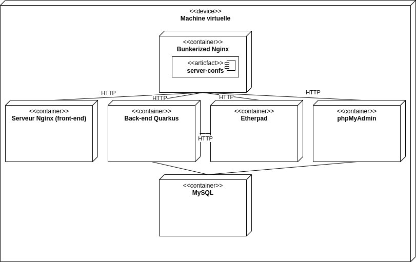

# Remote meetings planning

Application de prise de rendez-vous en ligne.

Les différents services :

- [https://aamiard.diverse-team.fr/](https://aamiard.diverse-team.fr/) front-end
  de l'application
- [https://aamiard.diverse-team.fr/api/](https://aamiard.diverse-team.fr/api/)
  API REST de l'application
- [https://aamiard.diverse-team.fr/pad/](https://aamiard.diverse-team.fr/pad/)
  Etherpad
- [https://aamiard.diverse-team.fr/phpmyadmin/](https://aamiard.diverse-team.fr/phpmyadmin)
  interface d'administration de la base de données

## Architecture

Les différents services sont déployés dans des conteneurs Docker sur une même
machine virtuelle :



## Déploiement

Prérequis : Docker

Il faut d'abord définir la variable d'environnement `DB_PASSWORD` qui contient
le mot de passe de la base de données MySQL (nom d'utilisateur `tlc`), par
exemple en créant un fichier `.env` à la racine du projet :

```sh
DB_PASSWORD=mot_de_passe_db
```

Ensuite, il suffit de lancer `docker-compose` :

```sh
docker-compose up -d
```

À la première exécution, le front-end et le back-end sont compilés dans des
images intermédiaires.
